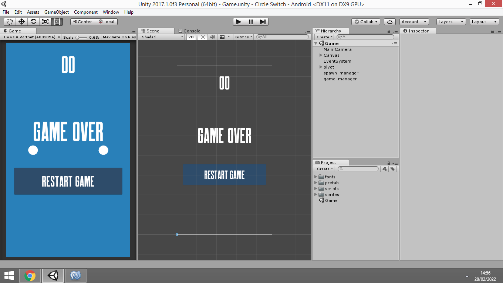

## Unity 3D - Circle switch android clone :

 Simple android game built with Unity 3D and C# , the game story is two circles rotating in a pivot and you can change the rotation direction by pressing the button on the screen ,for collision there is two game objects coin wish gives you points and enemy with end the game .

## Project Content :

 - Collision with gameobjects system by gameobjects tag names
 - Instantiation of prefabs
 - Communication between scripts
 - UI management system
 - Work with Coroutines

## Unity 3D Verion :

Unity 3D 2017.1

## Preview :

